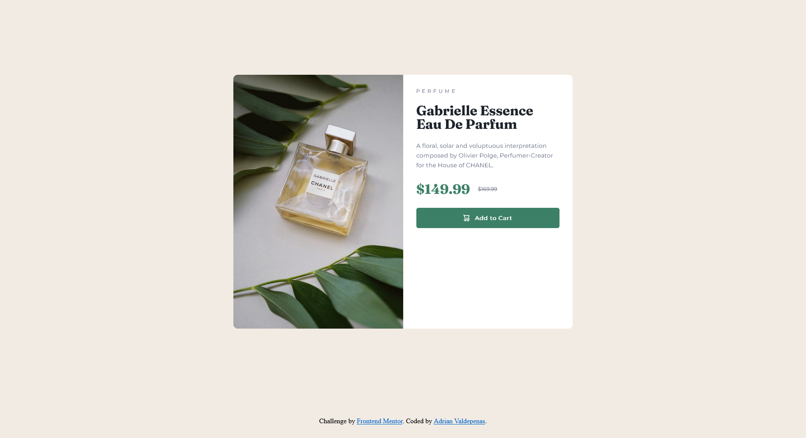

# Frontend Mentor - Product preview card component solution

This is a solution to the [Product preview card component challenge on Frontend Mentor](https://www.frontendmentor.io/challenges/product-preview-card-component-GO7UmttRfa). Frontend Mentor challenges help you improve your coding skills by building realistic projects.

## Table of contents

- [Overview](#overview)
  - [The challenge](#the-challenge)
  - [Screenshot](#screenshot)
  - [Links](#links)
- [My process](#my-process)
  - [Built with](#built-with)
  - [What I learned](#what-i-learned)
  - [Continued development](#continued-development)
- [Author](#author)
- [Acknowledgments](#acknowledgments)

**Note: Delete this note and update the table of contents based on what sections you keep.**

## Overview

### The challenge

Users should be able to:

- View the optimal layout depending on their device's screen size
- See hover and focus states for interactive elements

### Screenshot

### Links

- Live Site URL: [https://irnano.github.io/product-preview-card-component/)

## My process

### Built with

- Flexbox
- Mobile-first workflow
- [SASS](https://sass-lang.com/) - For styles

### What I learned

I learned about SASS and new extensions:

1. Live SASS Compiler (VS Code)
2. PerfectPixel By WellDoneCode (Chrome Extension)

PerfectPixel helped me adjust the tiniest details by overlaying the design challenge to my solution.

### Continued development

I want to improve my file structuring and apply best practices on sass and HTML too.

## Author

- Website - [Adrian Valdepenas](https://avaldepenas.vercel.app/)
- Frontend Mentor - [@iRNano](https://www.frontendmentor.io/profile/iRNano)

**Note: Delete this note and add/remove/edit lines above based on what links you'd like to share.**

## Acknowledgments

I got my inspiration from the works of Melvin Aguilar (https://www.frontendmentor.io/profile/MelvinAguilar). I also learned about PerfectPixel from his profile.
Of course, thank you to the creators/contributors of Frontend Mentor for giving us the opportunity to improve ourselves.
